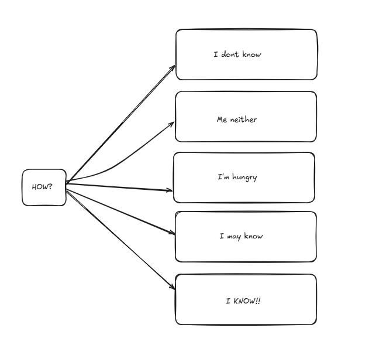

# Tactica

## Tactica? what's that?

Tactica is a desicion-making engine who aims to improve behavioral trees development. 

#### Why would I use it?
Well, tactica is meant to be the behavioral tree for a larger project of mine. However, long-term talking, it is expected to be a way to configure behavioral actions in a game engine we are preparing. You don't have to worry if it doesn't fit your game as it is intended to work with most(if not all) possible contexts.

## How it works? 

Let's dive into the good stuff: 

#### How does tactica knows the best play/solution for the upcoming actions? 
It doesn't. Is it stupid? probably yes. That's why tactica has to ask his imaginary friends what to do. 

But that is very ambiguous, tactica needs to react to as many situations as possible. Our goal is to cover the decision making needs for the developers in a game engine (It won't cover much on it's first versions, but we are trying to keep it scalable).

For us to make a decision there are multiple factors to consider. Here, we will call those factors "context". 